# Main page

## 

**THE DIFFERENCE BETWEEN AMERCAN AND BRITISH PUNK ROCK**

By: Fiene van der Geest

In this portfolio I'll present my research on the difference between British and American Punk music. I'll zoom in on:

- Track level features,
- Chroma features,
- Timbre,
- Temporal features and
- Clustering

## 


# Corpus

## 

**WHAT IS PUNK?**

For this portfolio I decided to take a closer look into de differences between American and British Punk rock. Punk rock as a genre is known for its music that returnes to the basics: it’s short, fast, loud and simple. As some people might say; “anyone who could hold an instrument, could make punk”. That idea of accessibility was a very big part of the punk movement. The movement as a whole was very DIY: start your own band, make your own clothes, do your own thing. Punk rebells against the commercialization of rock’n’roll.

Punk originates in New York City: The CBGB club became a hotspot for emerging punk bands. The Ramones are often called the first true punk rock band. A bit later punk also becomes a big thing in the U.K. with bands like Sex Pistols and The Clash.

Though American and Britsh punk definitely fall under the same genre, there are differences mentioned when talking about the two sub-genres. Some bigger than others. For instance, British punk is usually deemed more political and anti-establishment, more aggressive and noisy and faster than American Punk. American punk is thought to be more varied and to have a bit more developed styles.

My question for this portfolio is: Is there computational evidence for the difference between British and American punk rock?


## Spotify Playlist


## 

**CORPUS**

For this research project I used the playlists “70’s American Punk/NYC Punk Rock/CBGB” and “70’s/British Punk/UK Punk Rock” from Spotify. 

This analysis assumes that the selected Spotify playlists are representative of British and American punk. While they do contain many influential bands, they are curated playlists rather than historical archives.

<iframe style="border-radius:12px" src="https://open.spotify.com/embed/playlist/03PwoyMpiDWtMsHRN5d8V3?utm_source=generator&amp;si=45f8bc40aefe436e" width="100%" height="200" frameborder="0" allowfullscreen allow="autoplay; clipboard-write; encrypted-media; fullscreen; picture-in-picture" loading="lazy">

</iframe>

```{=html}
<iframe
  style="border-radius:12px"
  src="https://open.spotify.com/embed/playlist/2nJlTpJ7CLloGVbeFtCPWy?utm_source=generator&si=20a86d0571664239"
  width="100%"
  height="200"
  frameborder="0"
  allowfullscreen
  allow="autoplay; clipboard-write; encrypted-media; fullscreen; picture-in-picture"
  loading="lazy">
</iframe>
```

However, some of my analysis were done by comparing two specific songs. For these analysis, used at Chroma features, Timbre and Temporal features, I chose to use to songs that represented the sub genres as good as possible.

For these analysis I used the songs:

- Blitzkrieg Bop, by the Ramones - for American punk
- Anarchy In the U.K., by the Sex Pistols - for British Punk

I chose to use two songs for this portfolio to keep the different parts of the analysis mageble, though it might infuence the validity of the research. 

# Chroma features

## uitleg

**CHROMA FEATURES**

On this page I'll zoom in on the chroma features in 'Blitzkrieg Bop' and 'Anarchy In the U.K.'.

Chroma features tell us something about the harmonic content of a song, such as the different notes, chords and key's that are used in, and how they change throughout the song.

**CHROMAGRAMS**

In the column on the left we see two Chromagrams. The X-axis shows us the time, from the start to the end of the song, in seconds. The Y-axis shows the 12 notes. The different colours show how strongly a note is present at a certain moment, with yellow being the strongest and dark blue absent or very weak.

So, when looking at the chromagrams we see that in both cases a relatively small amount of pitch classes are dominantly present in the songs. This is not surprising, since punk songs usualy aren't very harmonically complex.

The chromagram for Blitzkrieg Bop looks a bit more uniform over time (relative clear and long horizontal lines), which suggest more repetition of the same harmonic material. Anarchy in the U.K. shows a bit more variation (still clear horizontal lines, but they're a bit more interrupted) but also show's a repetitive harmonic structure.

**DYNAMIC TIME WARPING**

But, to compare the songs more directly, I used Dynamic Time Warping (DTW). DTW is a way to compare two sequences, even when the two songs you're comparing don't have different tempos or section lenhths. In the DTW matrix, darker colours indicate a bigger harmonic similarity and lighter, yellow colours indicate dissimilarity.

In this DTW matrix, we see very little dark blue, showing little similarity between the two tracks. Had the songs been very similar in harmonic structure, I would have expected to see a clear, continuous dark line through the DTW matrix. We see some dark, diagonal segments, but also may lighter areas. The Matrix suggest that only some segments of the songs match well. This could probably be explained by the fact that both songs use simple, repetitive chord progressions that are often used in punk music.

## afbeeldingen

## chromagram

Chromagram Blitzkrieg Bop 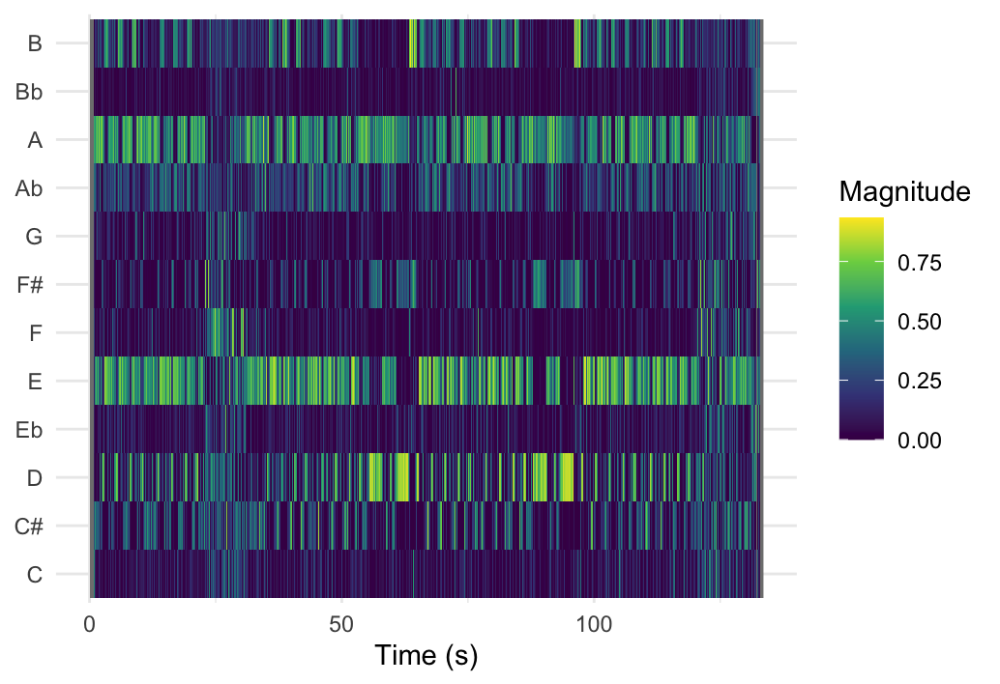

Chromagram Anarchy In the U.K.
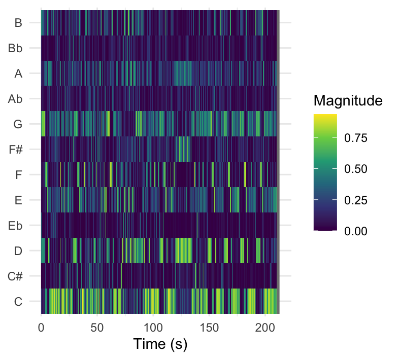

## DTW

DTW Matrix comparing 'Blitzkrieg Bop' and 'Anarchy in the U.K.' 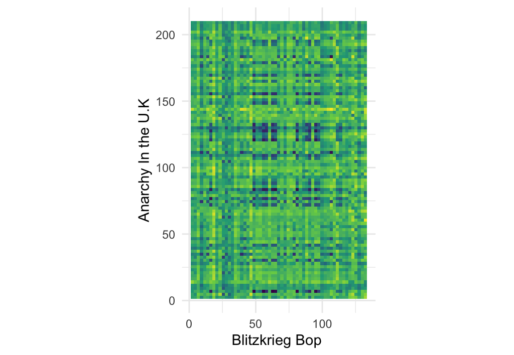

# Timbre

## 

**WHAT IS TIMBRE?**

Timbre is a complex quality to explain. It's the feature that makes the same two notes, played by two different instruments, sound different from each other. It refers to the overall texture of a sound.

In this analysis timbre is represented by Mel-Frequency Cepstral Coefficients (MFCCs). This coefficient is computed by taking qualities like distortion and frequencies compressing this information into a number.

On this page I used MFCC Self Similarty Matrices (SSMs). These matrices compare a song to itself, so every moment is compared to every moment in a song. High similartity will show up as bright, yellow blocks. Dissimilarity will show up as dark blue blocks. SSMs can tell us a lot about timbre structure throughout a song.

**SSM**

When looking at the SSMs we see that the songs have different timbre structures. Neither show very clear blocks that indicate a strict structure, and both SSMs are mainly bright yellow, indicating that both tracks are quite consistent in their timbre throughout the song. The bright yellow diagonal line trough both SSMs is the point where the tracks cross themselves and thus exactly overlap.

Blitzkrieg Bop had a less regular pattern, with less visible blocks. This probably means the timbre changes more gradual, with less defined patterns.

Anarchy has a clear block pattern. You can see both horizontal and vertical lines in the matrix. This indicates repeating patterns with similar timbre.

The American track appears to repeat similar sections more consistently, whereas the British track presents a slightly more varied timbre.

## 

'Blitzkrieg Bop' SSM 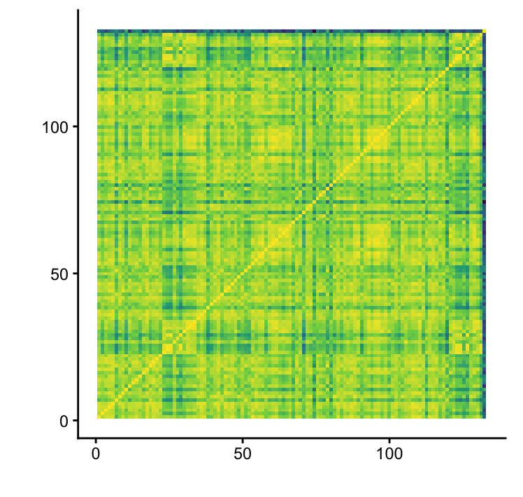

## 

'Anarchy In the U.K.' SSM 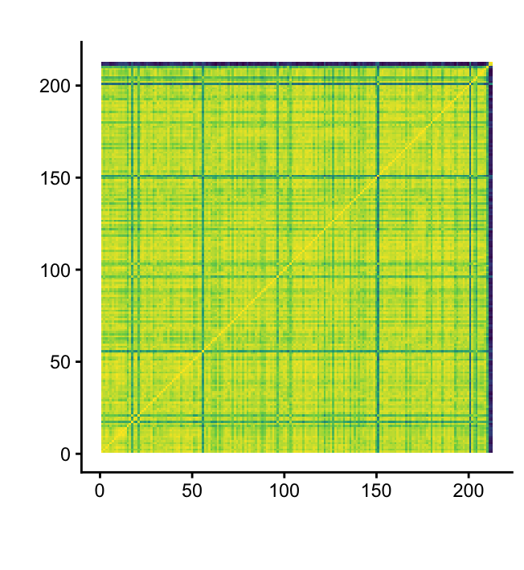

# Temporal features

## uitleg

**TEMPORAL FEATURES**

On this page I'll be doing a temporal focussed analysis of 'Blitzkrieg Bop' and 'Anarchy In the U.K.'. To analyse the temporal aspects of these songs I used two types of visualisations; An autocorrelation tempogram (ACT) and a novelty curve.

- ACT's show how strong a BPM at a certain time in a audio fragment. The X-axis shows the time and the Y-axis BPM. A brighter, yellow colour shows a higher presence of a BPM at a certain time.
- A novelty curve shows us moments where music changes. Again, the X-axis shows the time, the Y-axis shows the novelty, so the amount of change from one moment to the next.

**NOVELTY CURVE**

The novelty curve of Blitzkrieg Bop shows two main peaks at the beginning and end of the song, with two smaller peaks in between. This shows quite clearly defined sections in the song. The songs rythm changes at specific moments.

The novelty curve of 'Anarchy In the U.K.' looks very different from the 'Blitzkrieg Bop' one. 'Anarchy in the U.K.' has a lot of peaks, that are distributed throughout the entire song. The song's rhythm changes very consistently and doesn't show clear sections.

**ACT**

The 'Blitzkrieg Bop' tempogram shows a stable BPM. When there is a dominant BPM present it is consistent with the other moments we see a clear BPM. It is notable that in between these moments with dominant beats, we see quiet sections where the beat is not dominantly present.

The 'Anarchy in the U.K.' tempogram shows long horizontal stripes almost all troughout the song. This shows that the beat is consistently present in the song, without major tempo changes. There are two times in the middle of the song where the beat becomes a bit stronger.

**CONCLUSION**

Combining the two visualizations shows us that, though both songs have a stable tempo, the tracks differ in their structure. In 'Anarchy in the U.K.' we see more frequent, but smaller changes. In 'Blitzkrieg Bop' we see fewer, but structural changes throughout the song.

## novelty

Novelty curve 'Blitzkrieg Bop' 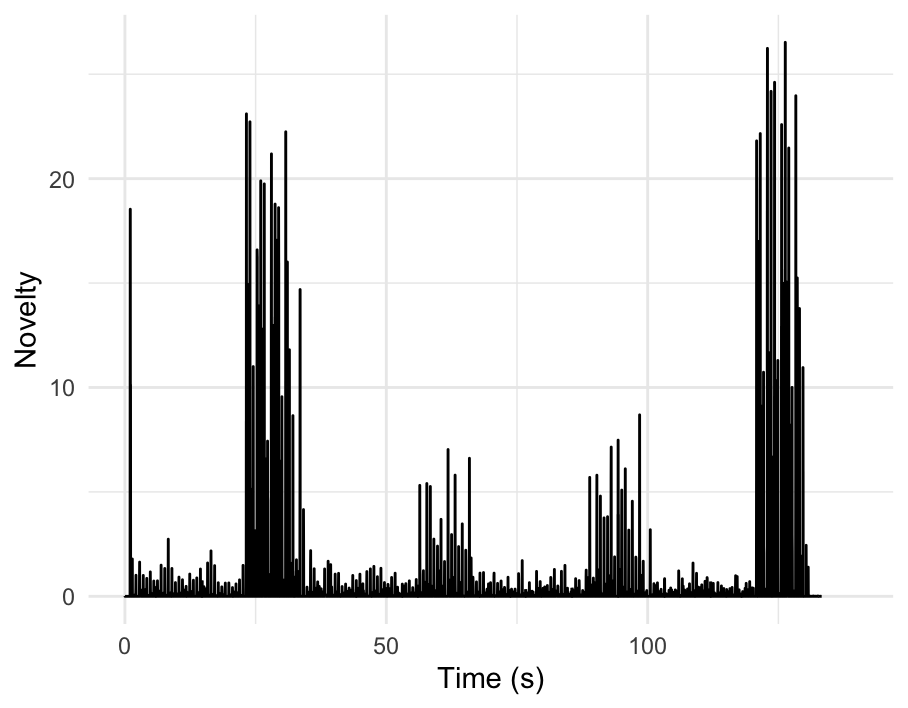

Novelty curve 'Anarchy In the U.K.' 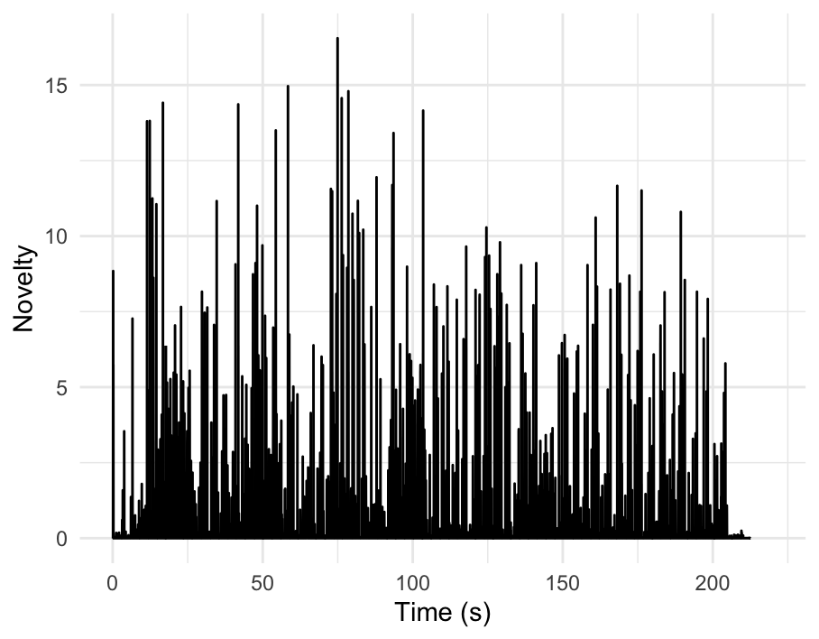

## ACT afb

ACT 'Blitzkrieg Bop' 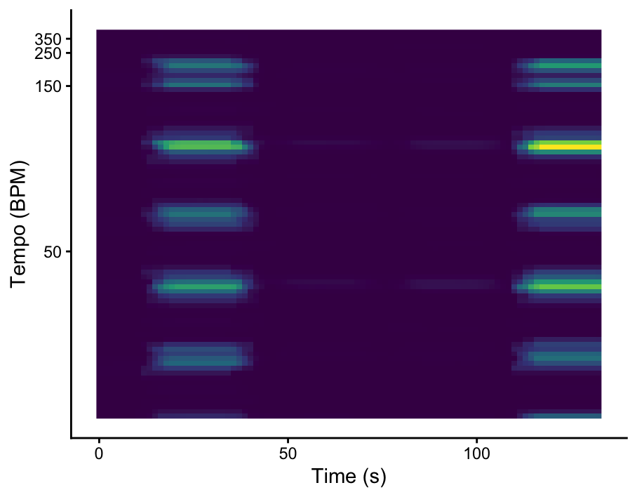 ACT 'Anarchy in the U.K.' 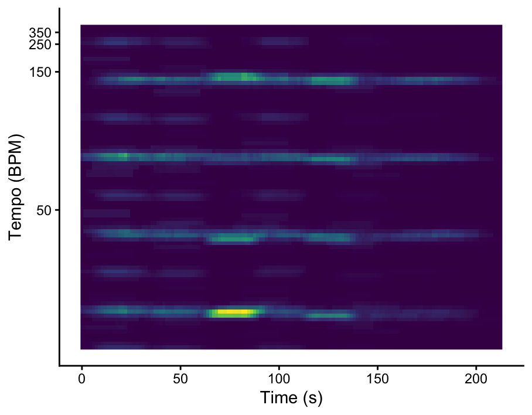

# Track level features

## 

**TRACK LEVEL FEATURES**

On this page, we'll take a closer look at the track level features and how American and British punk differ in this respect. To do this comparison I used the features energy, loudness, valence and speechiness.

- Energy means how intense or powerful a song sounds.
- Loudness means the average volume of a track, measured in decibels.
- Valance means the musical positivity of a track.

When looking at the different plots we can see that both American and British punk have a high energy, but that American punk seems a bit more divided and thus shows a bit more variation in energy between songs.

The loudness distributions are very similar. American punk displays a somewhat wider spread. Overall, loudness does not seem to differ between the two datasets.

Valence scores are also similar across both datasets. American punk seems to have a slightly higher median, indicating more positive or uplifting musical characteristics, but the substantial overlap suggests that this difference is relatively small.

Eventhough we can already see that both datasets are quite similar regarding these features, I tested for any significant differences. These test showed that no features followed the normal distribution and that non of the differences between American and British punk were significnat.

- energy (W = 19,878, p = .135)
- loudness (W = 22,875, p = .346)
- valence (W = 22,875, p = .346)

## 

Energy in American and British Punk 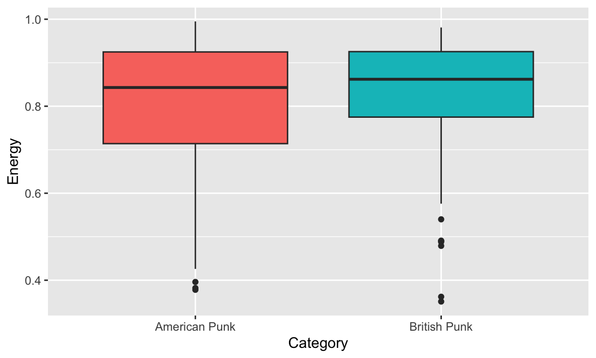

### 

Loudnes in American and British Punk 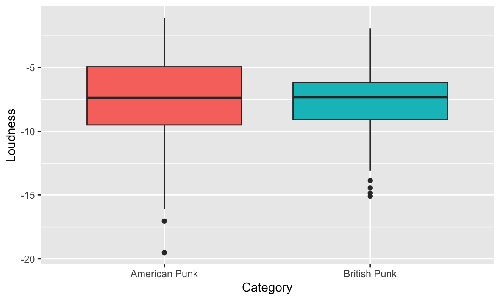

## 

Valence in American and British Punk 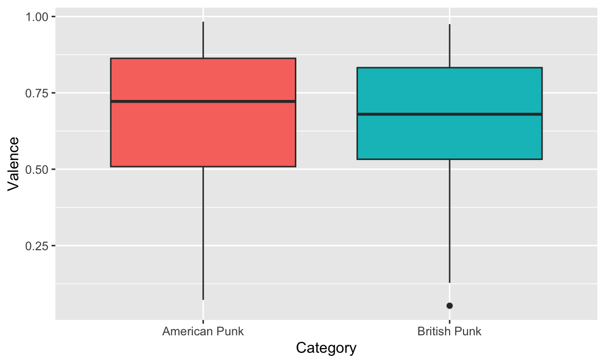

# Clustering

## uitleg

**CLUSTERING**

With clustering we try to group songs by their characteristics. If songs with similar features end up close together, these features tell us something about what distinguishes different groups, or in this case sub-genres.

**RANDOM FOREST PLOT**

The Random Forest Plot, onn the right, shows what features are of greatest importance in trying to distinguish British and American Punk. That means that:

- Liveness (in howfar sounds a song like it's performed live),
- Instrumentalness (amount of vocals vs. instruments in a song) and
- Loudness (the overall volume of a recording) and

contribute the most when trying to see the difference between the two sub-generes.

**SCATTER PLOT**

In the scatter plot, on the right, I tried visualizing the three most important variables. the X- axis shows liveness, Y-axis shows loudness, dot size shows instrumentalness and the colour of the dots show British vs. American data.

- With liveness, we see that the data points for both playlists are pretty much devided over the whole x-axis and that both sub-genres overlap almost completely.
- With loudness too, the two sub-genres overlap substantially.
- For Instrumentallness too, we can't see clearly separated clusters.

This shows me that non of the features provided by Spotify is enough to separate the American and British Punk playlists.

## importance afb
Random Forest 
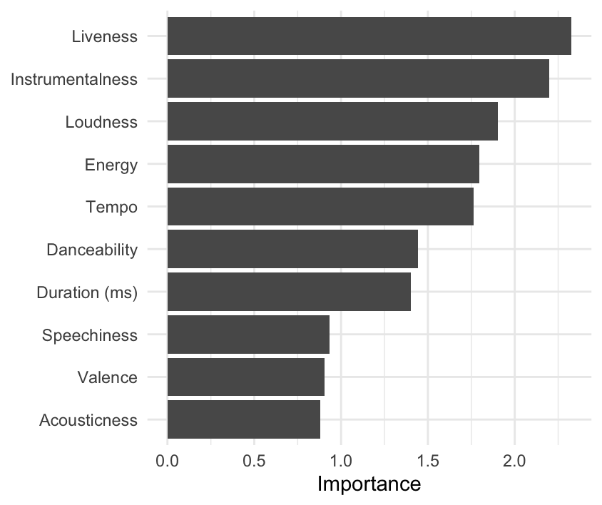

## clustering afb
Scatter plot 
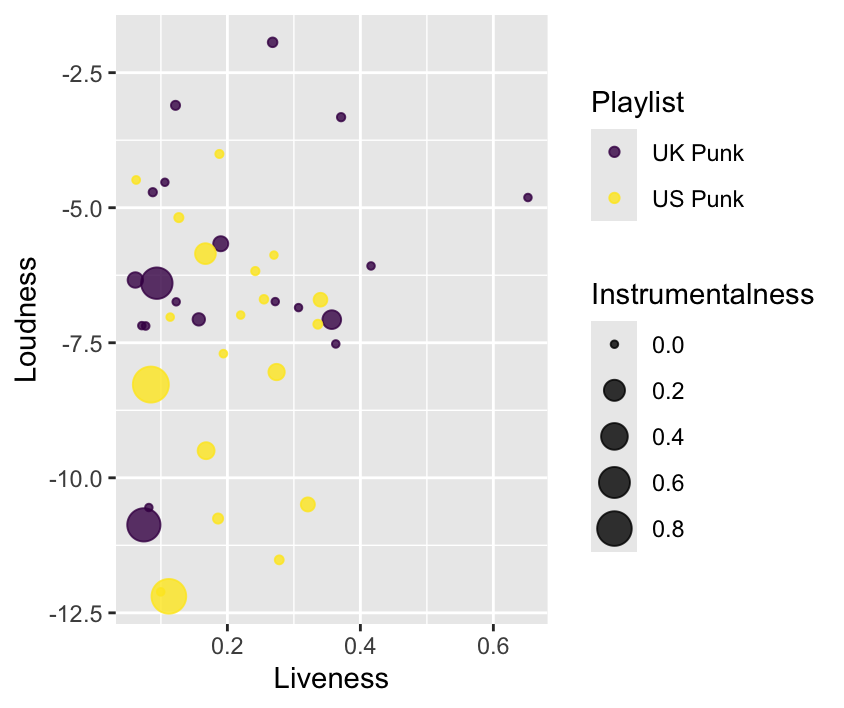

# Conclusion

## conclusions

**CONCLUSION**

Let's rewind: What conclusions can we draw form the previous pages?

- Chroma features: Both songs are quite simple if we look at their harmonic structure and material. Both songs contain similar harmonic material, but do not have the same harmonic structure.

- Timbre: Both tracks are quite similar in their general timbre. But again differ on their structure.

- Temporal features: In the temporal analysis we saw that Blitzkrieg Bop has clearly divided sections, where the rhythm changes in between. Anarchy in the U.K. seems to stay more consistent and change gradually rhytm wise. Both sons show a consistent BPM.

- track level features: When looking at track level features, like enery, loudness and valence, British and American punk are very similar. We see no significant differences between the two genres on these levels.

- Clustering: The clustering showed that based on the most important characteristics, American and British punk are not distinguishable.

If we combine these conclusions we can answer my reseach question for this portfolio: Is there computational evidence for the difference between British and American punk rock?

No, there does not seem to be any computational evidence for a difference between British and American punk rock. Both when looking at the whole playlist and when looking at the specific tracks we used I cannot find any significant differences between the two sub-genres, that can not be attributed to the differences you'd expect between two different songs.

These findings could suggest that the perceived difference between the two sub-genres is more cultural, historical or lyrical than it is musical. This is interesting because it shows that no every musical aspect can be captured by computational analysis of audio features.

It is also important however, to note that these findings give a very narrow view of punk music. I used a relatively small sample of British and American punk. Besides, these findings are for a large part based on the comparison between two songs. This too is a too small sample to make strong assumptions.

## reflection


