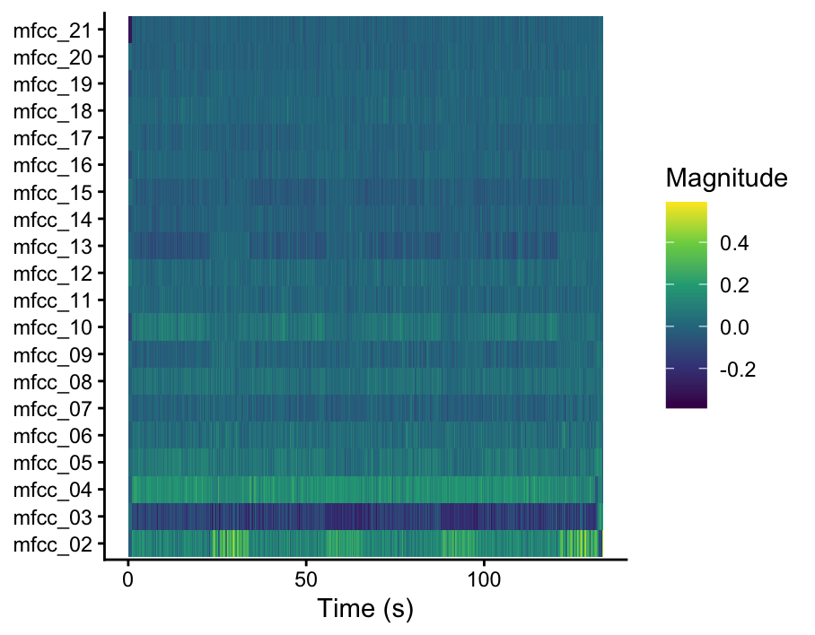
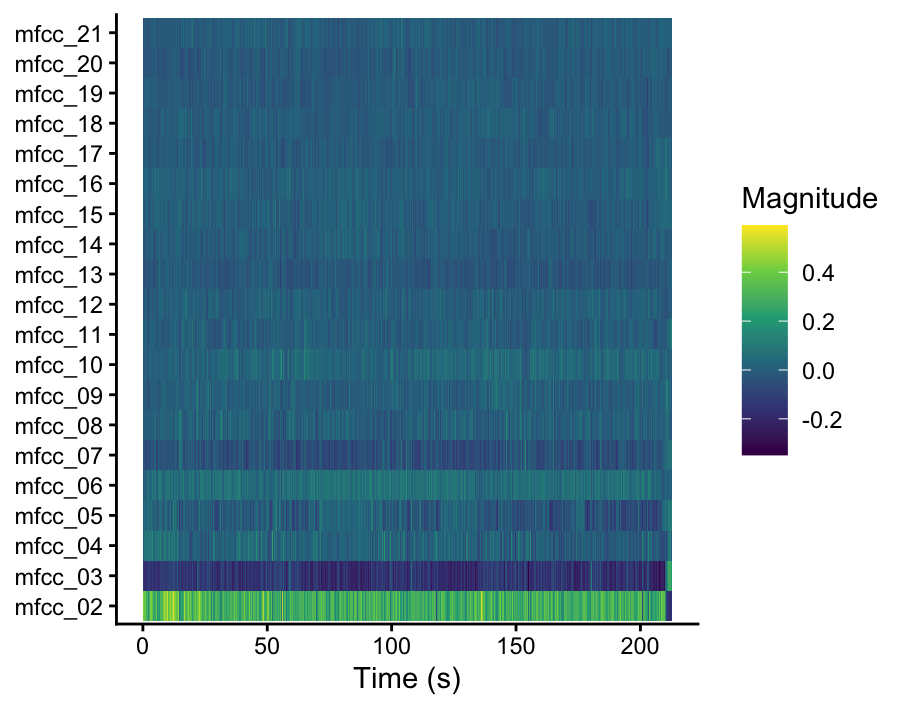

# voorpagina

In this portofolio I'll present my research on the difference between British and American Punk music, mainly focused on music made in the 70's. 

# Chroma features

## uitleg

On this page I'll zoom in on the chroma features in 'Blitzkrieg Bop' and 'Anarchy In the U.K.'. 

Chroma features tell us something about the harmonic content of a song, such as the different notes, chords and key's that are used in, and how they change throughout the song. 

In the column on the left we see two Chromagrams. The X-axis shows us the time, from the start to the end of the song, in seconds. The Y-axis shows the 12 notes. The different colours show how strongly a note is present at a certain moment, with yellow being the strongest and dark blue absent or very weak. 

So, when looking at the chromagrams we see that in both cases a relatively small amount of pitch classes are dominantly present in the songs. This is not surprising, since punk songs usualy aren't very harmonically complex. 

Blitzkrieg Bop looks a bit more uniform over time (relative clear and long horizontal lines), which suggest more repetition of the same harmonic material. 
Anarchy in the U.K. shows a bit more variation (still clear horizontal lines, but they're a bit more interrupted) but also show's a repetitive harmonic structure.

But, to compare the songs more directly, I used Dynamic Time Warping (DTW). DTW is a way to compare two sequences, even when the two songs you're comparing don't have different tempos or section lenhths.
In the DTW matrix, darker colours indicate a bigger harmonic similarity and lighter, yellow colours indicate dissimilarity. 

In this DTW matrix, we see very little dark blue, showing little similarity between the two tracks. 
Had the songs been very similar in harmonic structure, I would have expected to see a clear, continuous dark line through the DTW matrix.
We see some dark, diagonal segments, but also may lighter areas. The Matrix suggest that only some segments of the songs match well. 
This could probably be explained by the fact that both songs use simple, repetitive chord progressions that are often used in punk music.

## afbeeldingen

## chromagram

Chromagram Blitzkrieg Bop

Chromagram Anarchy In the U.K.

## DTW 
DTW Matrix comparing 'Blitzkrieg Bop' and 'Anarchy in the U.K.'

# Timbre

##

in this histogram 

## MFCC afb

Blitzkrieg Bop

##
Anarchy In the U.K.

# Temporal features

## uitleg 
in deze .. 

## ACT afb

Blitz ACT

Anarchy ACT

## novelty 

# Track level features 

## 

On this page, we'll take a closer look at the track level features and how American and British punk differ in this respect. 
To do this comparison I used the features energy, loudness, valence and speechiness.

- Energy means how intense or powerful a song sounds. 
- Loudness means the average volume of a track, measured in decibels. 
- Valance means the musical positivity of a track. 

When looking at the different plots we can see that both American and British punk have a high energy, but that American punk seems a bit more divided and thus shows a bit more variation in energy between songs. 

The loudness distributions are very similar. American punk displays a somewhat wider spread. Overall, loudness does not seem to differ between the two datasets.

Valence scores are also similar across both datasets. American punk seems to have a slightly higher median, indicating more positive or uplifting musical characteristics, but the substantial overlap suggests that this difference is relatively small.

Eventhough we can already see that both datasets are quite similar regarding these features, I tested for any significant differences. 
These test showed that no features followed the normal distribution and that non of the differences between American and British punk were significnat.

- energy (W = 19,878, p = .135)
- loudness (W = 22,875, p = .346)
- valence (W = 22,875, p = .346)

##

Energy in American and British Punk 

###

Loudnes in American and British Punk

##

Valence in American and British Punk

# Clustering
## uitleg
wat zien we?

## importance afb

## clustering afb

# Conclusion
What have you learned from this set of analyses? Who could these conclusions benefit, and how?